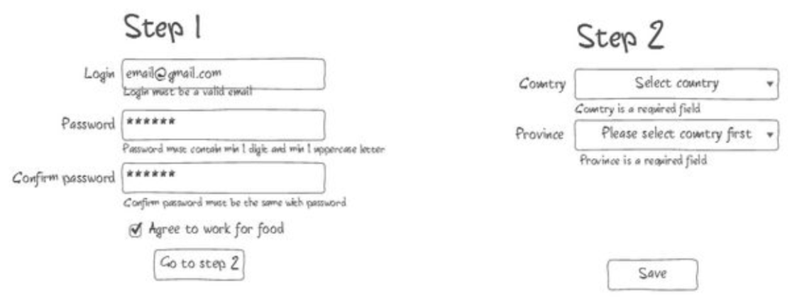

# .NET Core, Angular application

## Tech requirements:
- Front-end: [Angular](https://angular.io/)
- Back-end: ASP.NET Core [Web API](https://docs.microsoft.com/en-us/aspnet/core/web-api)
- ORM: Entity Framework Core with [migrations](https://docs.microsoft.com/en-us/ef/core/managing-schemas/migrations/)
- No design is required, optionally [Angular Material](https://material.angular.io/) can be used as a design framework

The result should be presented as a working Visual Studio solution/project. F5 to get working.
Your code will be evaluated and reviewed as if it would be a real application (application structure, best practices, code quality, maintenance), so try to demonstrate your skills, some design patterns. Besides this, feel free to choose any other libraries, frameworks, patterns, test (fake) data, etc. For example, a database with country/province can contain only 2 test countries and 2-3 test provinces for each country. (Country 1, Province 1.1, Province 1.2, is also okay). This data should be seeded on the application start.

**If you miss some information, do not ask - do it in the way you think it should be done correctly.**

**Description:**

You need to create a simple web page that should contain a registration wizard. The registration wizard includes two steps:

_Step 1: (all fields are required)_

- Login - valid email.
- Password - must contain min 1 digit and min 1 letter.
- Confirm password - must be the same with the field ”password”.
- I agree checkbox - is a required checkbox.
- Button next - should validate all fields on the step and show validation errors (under the fields) or go to the next step.

_Step 2: (all fields are required)_

- Country - drop-down list, which contains a list of counties.
- Province - contains a list of provinces for the selected country. The list of provinces should be loaded by AJAX if the country is changed.
- Button save - should validate all fields on the step and show validation errors (under the fields) or save the data from the wizard to the database using AJAX call.

